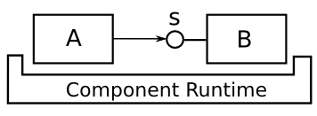
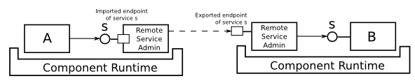
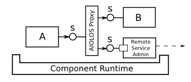
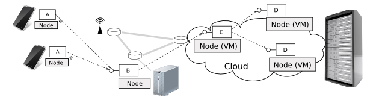
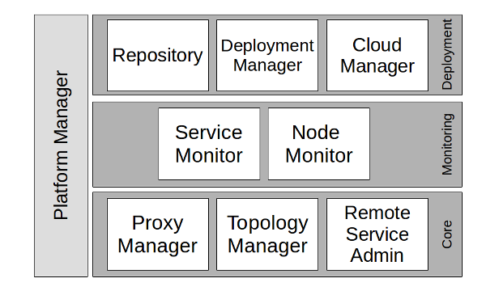

AIOLOS overview
===============

AIOLOS is a framework for scalable component-based (mobile) cloud applications. The framework
is built on [OSGi](http://www.osgi.org), a popular component runtime on Java. Hence, AIOLOS
shares a lot of the same concepts as OSGi. In fact, any well designed OSGi application should
be able to run and benefit from the AIOLOS framework in a distributed environment. 

Before delving into the complete AIOLOS architecture, we first introduce the base concepts
on which AIOLOS is based.

Components and services
-----------------------

Applications in AIOLOS are defined as a number of loosely coupled software components, that
can provide well-defined interfaces to other components, called services. Communication between
components happens by calling methods from these service interfaces.

Components run in a component runtime, which manages the component lifecycle, dependency resolution 
and service lookups. The AIOLOS framework is built on top of the OSGi framework, hence using the 
OSGi component (mostly called bundles in OSGi) definition, lifecycle management and dependency 
resolution mechanisms.

Remote services: importing and exporting endpoints
--------------------------------------------------

To run components in a distributed environment, components have to communicate over the network
using a remote procedure call protocol. To allow remote method calls, AIOLOS provides an implementation
of the [RemoteServiceAdmin](http://www.osgi.org/javadoc/r4v42/org/osgi/service/remoteserviceadmin/package-summary.html) 
specification.

At the service producer side, the RemoteServiceAdmin generates a so called endpoint of the hosted service,
which is accessible over the network. At the service consumer side, the endpoint is imported and the service
is proxied. This way, component A can still perform method calls to service s. The RemoteServiceAdmin is 
responsible for forwarding these calls to the remote endpoint and execute the method offered by component B.

Service proxies
---------------

Proxying services is also used in AIOLOS in order to gather monitoring information about the components and
their services, as well as to hide remote or local execution from the application bundles.

For each service, AIOLOS generates a dedicated service proxy and hides all other service instances for the
application. This way, all method calls of the service will first pass the AIOLOS proxy, allowing to gather
monitoring information such as how many times a service is called, or how much time is spent in these method calls.

Also, when a method is called, the AIOLOS proxy can decide to which service instance the call is forwarded.
For example on a mobile device, AIOLOS can decide whether the method should be called locally, or offloaded
to the cloud (i.e. when not enough CPU resources are available on the device). In a cloud scenario, this 
can be used to balance the load over different component instances.
 

Nodes and the Cloud
-------------------

Each machine that runs the AIOLOS framework is called a node. A node can be either a physical or a virtual 
machine, a mobile device or a server. All nodes are connected by a network, and components can be distributed
and scaled among all the interconnected nodes. 

The goal of AIOLOS is to manage all nodes and running components in order to optimize the application, e.g.
by offloading in a mobile computing scenario, or by scaling in a cloud scenario.

AIOLOS architecture
-------------------

AIOLOS is built on top of OSGi, and is modular by itself. The AIOLOS middleware can be split up into
three layers: the core, monitoring and deployment layer.

The core layer provides the basic building blocks enabling service distribution and proxying: 

- ProxyManager

  The *ProxyManager* creates a proxy of each service, and hides all service instances behind this proxy instance.
  This allows to capture all service method calls for monitoring, and also enables to decide at runtime to which
  instance service calls are to be dispatched, by providing a so called `ProxyPolicy`.

- RemoteServiceAdmin

  The *RemoteServiceAdmin* bundle implements the `RemoteServiceAdmin` OSGi specification and can export and import
  service endpoints in order to enable remote method calls. The protocol used is based on [R-OSGi](http://r-osgi.sourceforge.net/),
  and uses [kryo](https://github.com/EsotericSoftware/kryo) for fast serialization of objects.  
  
- TopologyManager

  *TopologyManager*s of different nodes exchange endpoint descriptions, enabling to share services between
  interconnected nodes. At the moment, the *TopologyManager* just shares all services, but a more complex
  strategy (only sharing required services) could be implemented. 

The monitoring layer collects information on service level and node level.

- ServiceMonitor

  The *ServiceMonitor* receives events each time a service method is called, and aggregates monitoring 
  information of all services.

- NodeMonitor

  The *NodeMonitor* monitors system-wide metrics such as CPU and memory usage. The implementation is currently
  based on the Linux `/proc` filesystem, and thus will not work on operating systems like Windows.

The deployment layer provides components to lookup and deploy components, and to start or stop new VMs in a cloud environment for scaling out.

- Repository

  The *Repository* bundle implements the `Repository` OSGi, which exposes a number of component artifacts
  (i.e. the .jar files) and indexes their capabilities for dependency resolution.
  
- DeploymentManager

  The *DeploymentManager* provides an interface to start, stop or migrate components. The component artifacts
  and their dependencies are fetched from a *Repository*, i.e. the one hosted on the management node. When
  starting a component, also its dependencies are resolved using the [Felix Resolver](http://felix.apache.org/downloads.cgi) 
  implementation.

- CloudManager

  The *CloudManager* is only of purpose in cloud environments, and provides an interface to start, stop and
  configure new virtual machines. Currently there is an implementation available for the OpenStack cloud, but
  as it is based on the [jclouds](http://jclouds.incubator.apache.org/) library, it should also work on other 
  clouds with little effort.

Finally, the *PlatformManager* provides a unified interface to the AIOLOS platform, accessible 
for 3rd party applications. For example we provide a UI bundle that builds on top of the *PlatformManager*
and provides a web-based user interface to the AIOLOS bundles, as an extension of the 
[Apache Felix Web Console](http://felix.apache.org/site/apache-felix-web-console.html).

For detailed info on how to extend or use the AIOLOS framework, we refer to the [javadoc of the AIOLOS API](javadoc/index.html)